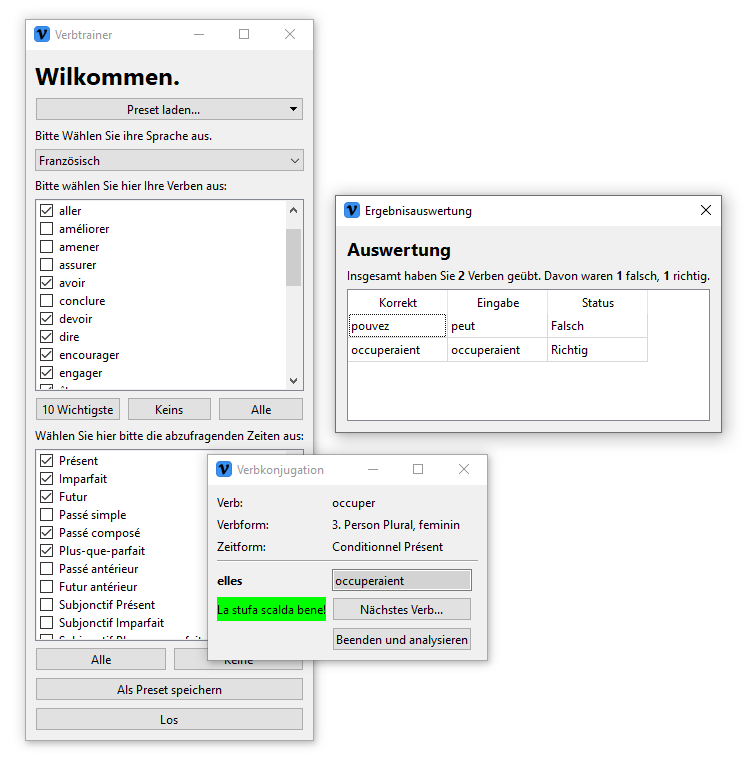

# Verbtrainer
Very simple verb conjugate trainer written in python. Warning: If you want to look at the source code, make sure you are under medical supervision.

## Install
For running the program, [Python](https://www.python.org) has to be installed on your computer. You can install the requirements for this shit by using the requirements.txt:

    pip install -r requirements.txt

## Supported languages
Currently, only Italien and French are supported and only with a limited number of verbs and tenses. This program does not use a library to conjuate the verbs, it has a (very dirty, please don't look at that dogshit) sqlite-database.

The User Interface is currently only available in German, but my goal is to add English in the near future.

## Screenshot
